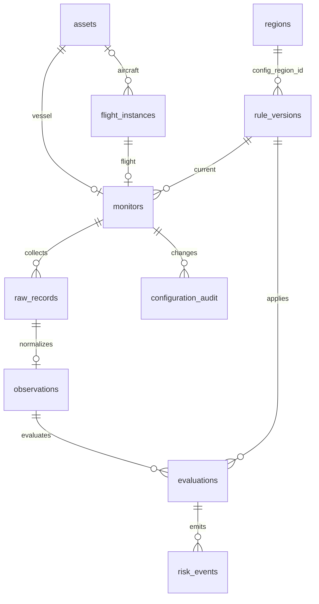

# 风险资产监控 MVP 设计

## 目标与业务口径
本地 FastAPI 单体服务 + 原生 HTML/CSS/JS 页面 + SQLite。数据源包含 mock-v1、digitraffic-v1 和 adsblol-v1；页面和事件按来源区分真实与模拟，详见 [公开数据接入](public-data.md)。
添加 → 采集 → 原始数据落库 → 标准化 → 数据质量检查 → 确定性规则 → 事件 → 展示。

- 船舶优先 IMO（验证校验位），可用 MMSI；名称不是身份。一个船舶监控一个矩形区域。
- 飞机实体独立存储；航班实例唯一键为运营方、班号、服务日期、起降机场。服务日期对应请求所填出发时区的计划起飞日期。
- 计划时间固定为创建时的基准；预计和实际分开，实际优先；可以配置起飞/到达口径。
- 延误精确分钟数 > 阈值触发，等于阈值不触发。首次有效状态已超阈值也触发。
- 区域边界属于区域内；首次在区域内属于 first_seen_inside，不能冒充 entered_region。
- 进入/离开仅表达相邻有效定位内外变化，不推断定位间完整轨迹或精确跨界时刻。
- 持续风险不重复报警，恢复和再次进入产生新事件。取消、备降分别产生事件。
- 取消/备降期间暂停延误计算，常规状态恢复后重新判断。
- 规则更新新建版本、清空该监控规则状态；下一次新的有效状态按新规则判断。历史事件依据保持原版本。
- 数据超过 15 分钟、未来超过 60 秒、缺关键字段、乱序、重复分别处理；未知不等于安全。
- 重复/乱序不覆盖状态和健康信息；此时旧数据只留在原始记录中。
- 数据中断后与最后有效状态比较，证据保留两次时间；不能断言缺失期间没有其他跨越。
- API 和 Start.ps1 默认每 3600 秒自动采集；RISK_POLL_SECONDS=0 关闭，其他值须 >= 5。船舶/航空可分别手动刷新。页面读取本地数据不触发外部采集。每轮对单个对象的错误隔离。
- Mock 四步循环：船舶 outside → inside → inside → outside；航班 on_time → delayed → delayed → recovered。
- 手动指定场景也会推进 cursor。场景是可重复的输入，不依赖真实世界航运事实。

## 架构和事务边界
前端只访问本地 API，不直接调用供应商。Provider.fetch 返回载荷；
原始记录先提交，再 normalize 为 Observation。Provider 不产生风险事件。
规则是纯函数。Store 负责事务和证据关联。
一次状态、评估、事件、监控状态更新处于同一事务中。
原始记录使用规范 JSON SHA-256，用于内容核对；不是防篡改签名或 WORM 审计。
本地 MVP 仅支持单进程（不要增加 uvicorn workers）；RLock 串行化采集与配置变更，SQLite WAL + 事务保证一致性。
SQLite 文件的真实迁移记录为 schema_versions；v1 为监控基线，v2 在 Portal 初始化时增建公开信息、AI 开关和 AI 调用审计表；v3 显式备份并迁移监控对象约束以允许飞机实体，验证外键和历史数据保留；v4 备份后增加目标 profile、目标/区域 deleted_at 及 region_audit。删除保留外键及证据，默认查询和采集排除已删除目标；恢复目标保持暂停。下一次结构修改必须新增显式迁移，不能修改已有基线猜测迁移结果。

## ER 图

region_id 位于规则配置 JSON，由应用校验；ER 此边是逻辑关联，其余实体关系有数据库外键。
历史规则与区域不提供更新或删除接口；新区域使用新 ID。
事件是不可变事实，不是工单。正常评估也保存结果。
事件详情关联原始响应、哈希、当前/上次状态、区域、规则版本和引擎版本。
配置变更记录尚无人员身份（本地无认证），不能作为正式银行人员审计。

## 代码职责
- backend/models.py：输入、标准化模型与业务校验。
- backend/providers.py：Provider 协议与 Mock。
- backend/live_providers.py：公开源、身份校验、时间标准化、限频缓存。
- backend/migrations.py：保留历史的飞机实体约束迁移。
- backend/rules.py：确定性规则。
- backend/store.py / schema.sql：持久化与配置审计。
- backend/app.py：REST Contract、任务调度。
- demo.html / static/app.js / static/app.css：沿用参考布局的 Dashboard 与 API 客户端。
- backend/portal.py：公开信息、页面汇总、可选 AI 适配及审计。
- docs/openapi.json：生成的接口契约，服务运行后 /docs 可交互使用。

## 已知边界
- 区域仅支持不跨日界线的经纬度矩形，以 GeoJSON Polygon 存储；无空洞、航迹插值。
- 页面使用本地 Natural Earth 世界陆地底图，无在线瓦片或地图 API 依赖；位置按目标使用真实公开源或 Mock；点位更新不等同于完整航迹。
- 不支持 AIS 长时间失联业务规则、股票/企业监控、推送、账户和高可用。
- 飞机实体有独立关系，暂无独立飞机监控或身份变更历史流程。
- 船舶身份可用 IMO 或 MMSI；跨标识合并及 MMSI 历史变化需真实数据接入时扩展。
- 同一时间戳的供应商修订当前按重复忽略，本次公开源保留此限制；支持修订的后续供应商应接入序列号/修订版本。
- 只保留创建时的计划时间基准；未来可额外记录供应商计划修订，但不能悄悄重置延误基准。
- SQLite 是本地可追溯存储，不是合规归档；正式环境需要受控权限、留存、加密备份和审计增强。
